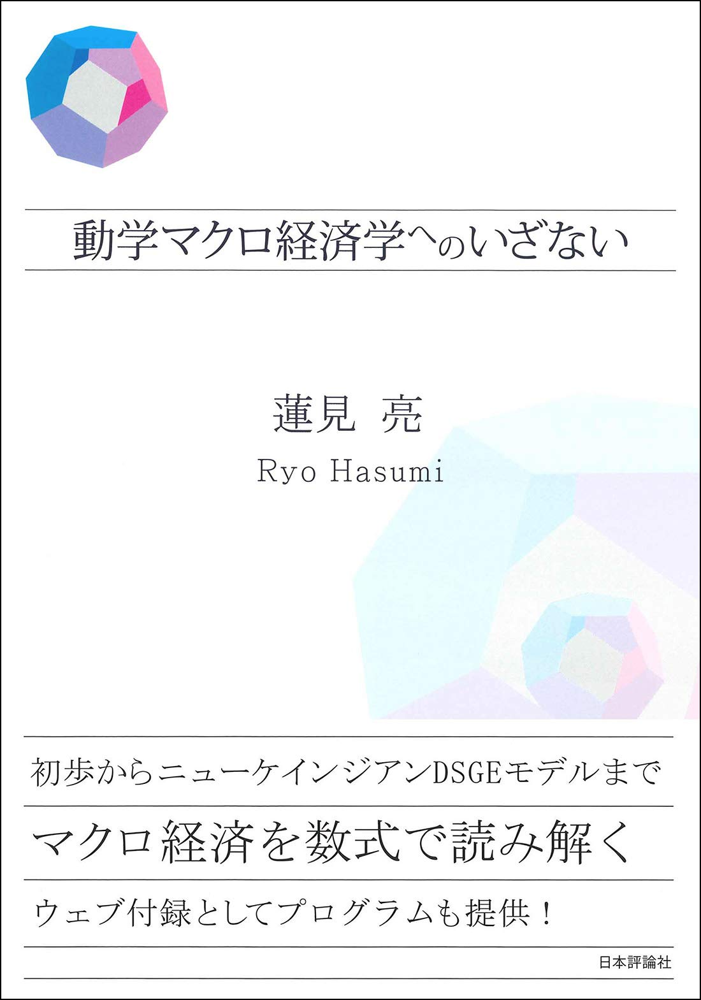

# 動学マクロ経済学へのいざない

> 蓮見 亮 (著)

最近对宏观经济学感兴趣，就上网买一本动态宏观经济学的书。偶然翻到ryo hasumi的宏观经济学导论，读来十分友好。短短的200多页的内容，居然讲到 DSGE ，而且每个章节都有相应的 R 语言的代码，地址见下。

这个文档主要是这本书的笔记。

- 网络地址

[R言語コード](https://github.com/rhasumi/dynamicmodels)

[蓮見亮のホームページ](https://rhasumi.net/)

---

