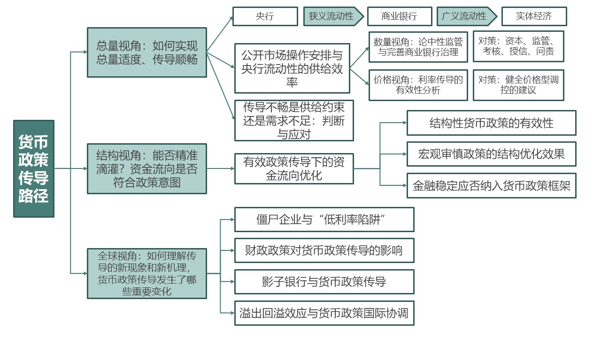

# 《多重约束下的货币政策传导机制》

> 张晓慧著

# 本书框架

本书分为 3 篇。大体结构为：总量视角 $\rightarrow$ 结构视角 $\rightarrow$ 关于货币政策的重要讨论

## 全书章节笔记整理

**第一篇 何为顺畅的货币政策传导：梗阻的的辨识与消除**

- CH1 公开市场操作安排与央行流动性供给效率
- CH2 货币政策的数量视角：论优化监督与完善商业银行治理
- CH3 货币政策传导价格视角：利率传导的有效性分析
- CH4 供给约束还是需求不足：判断与对策

**第二篇 何为有效的货币政策传导：资金流向能否优化**

- CH5 结构性货币政策工具在货币传导中扮演的角色
- CH6 宏观审慎政策对货币传导效率的提升
- CH7 金融稳定对货币政策传导效率的影响

**第三篇 全球货币政策传导的新现象和新机理**

- [CH8 供给侧视角下的僵尸企业与 “低利率陷阱”](https://myeconomics.cn/economics/多次约束下的货币政策/Ch8.pdf)
- [CH9 财政政策对货币政策传导的影响：兼论现代货币理论的是与非](https://myeconomics.cn/economics/多次约束下的货币政策/Ch9.pdf)
- CH10 影子银行与货币政策传导
- CH11 溢出、回溢效应与货币政策的国际协调

