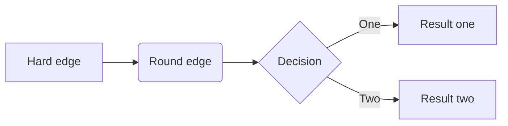

# 第二章 分析通货膨胀

## 2.1 可贸易部门的通货膨胀

### 2.1.1 全球生产者价格的同步性

### 2.1.2 主导 PPI 波动的因素

我们一般认为**全球制造业需求的变化**及**中国需求的强弱**对 PPI 波动有重要影响。此外，**美元汇率**的波动、**大宗商品市场**的冲击以及**全球总供应层面的变化**也是值得关注的。

为何在我们的框架中，工业品价格由全球供需和一价定律决定，而农产品价格受通胀预期决定？

